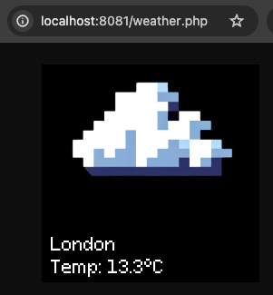

# smalltv-pro-webapp
A simple web server that generates dynamic images. The idea is to create simple apps for https://github.com/GeekMagicClock/smalltv-pro (see issue: https://github.com/GeekMagicClock/smalltv-pro/issues/42)

Currently, the demo contains a simple php page (weather.php) that returns a 240x240 image, with the current weather location

```
docker build . -t smalltvpro-app
docker run -d -p 80:80 smalltvpro-app
open 'http://localhost:80/weather.php'
```


